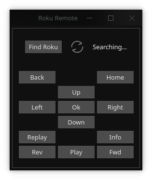

# rust-roku
A simple Roku remote client with SSDP discovery, using Rust and QML

The QML UI does not expose all features of the backend yet, most notably being able to select one of several available Roku devices (it just grabs the first one it sees), as well as app/channel support or general text entry.

This project primarily just a way for me to get my feet wet with Qt/QML and Rust UI; a more sensible client would probably be written in Python or similar (and not be a 9MB binary), but it meets my needs and might be a useful example for others.

# Features/Limitations
- Automatic device discovery, only uses the first device found
- Keyboard shortcuts, Left/Right/Up/Down, Space to play/pause, Enter to select, and a few others

# Screenshot

